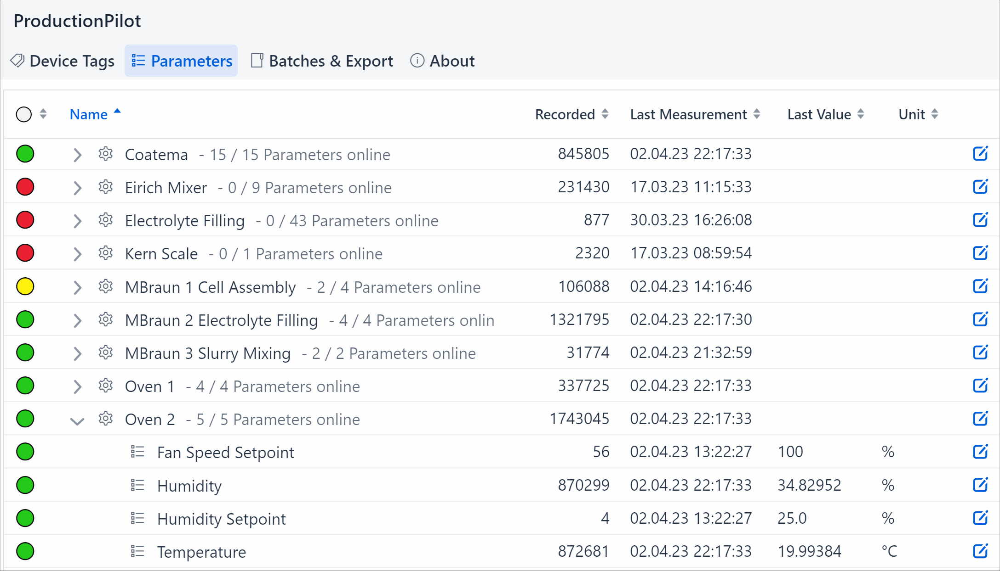

# ProductionPilot


Enabling industrial production research - by providing a user-friendly interface to collect, structure and export live data from industrial machinery. Speaks the industry standard OPC UA protocol.

## Running the application
1. Install docker with docker-compose.
2. Check out this project from git:
```
git clone https://github.com/fkirchmann/ProductionPilot.git
```
3. Run the following command in the root of the project:
```
docker-compose up
```
  - Batteries included! This stack also runs a postgres database and an [IIoTranslator](https://github.com/fkirchmann/IIoTranslator) OPC UA server for you. You can edit the [compose file](docker-compose.yml) to use your own database and/or OPC UA server.
4. You can now access ProductionPilot at http://localhost:8080

## REST API
The application exposes a REST API. Check out ``/api-docs/v1/swagger-ui/index.html`` on a running instance, or click [here](http://localhost:8080/api-docs/v1/swagger-ui/index.html) to access it directly if you're running the application locally.

## Tech Stack
- Java 17
- Spring Boot 2.7
- PostgreSQL
- Hibernate
- Liquibase
- Eclipse Milo OPC UA SDK
- Vaadin 23
- Docker & BuildKit & docker-compose

## Usage
### Selecting & Annotating Tags to Record
1. Click on the "Device Tags" button in the top left.
2. Explore the available tags on the OPC UA server, and pick one you want to record.
3. Click the blue "plus" button next to the tag.
4. Select a machine to assign the tag to, or create one.
5. Type a name for the tag, and optionally other information, such as a unit or a description.
6. Click "Create", and the tag will be recorded from now on. You can observe this on the "Parameters" page.

### Exporting Recorded Data
1. Open the application in your browser.
2. Click on the "Batches & Export" button in the top left.
3. Create a Batch by clicking the "Create" and then "Batch" button.
4. Select the Batch you just created, and click "Create" and then "Measurement Range".
5. Specify the machine and the start and end date of the data you want to export, then confirm.
6. Select the Batch and click "Export" to download the data as CSV.

## Development
1. Install Java 17 and Maven, and an IDE of your choice (IntelliJ IDEA recommended).
2. Check out this project from git.
3. Create a ``config`` directory in the root of the project, and add a ``application.properties`` file to it. You can use the [example file](application.properties) as a starting point. Be sure to provide a PostgreSQL database and an OPC UA server.
4. Run the following command in the root of the project:
```
mvn spring-boot:run
```
5. You can now access ProductionPilot at http://localhost:8080
6. After making changes, run ``mvn spotless:apply`` to format your code before committing.